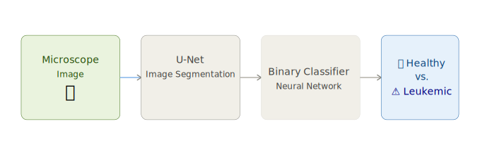

[← Back](../)

# 🧠 ANNa

> *"Cancer doesn't grow from yesterday to today. There are signs in the tissue, but the human eye has limited ability to detect very small patterns."*  

— **Regina Barzilay**, First winner of the Squirrel AI Award

## What is ANNa?

**ANNa** is a deep learning model that classifies **leukemic vs. healthy cells** from microscopic images — tackling one of the most common pediatric cancers: **Acute Lymphoblastic Leukemia (ALL)**, which accounts for 25% of all childhood cancers.

## How it Works

ANNa combines two networks:
- **U-Net** — extracts and segments relevant cell features
- **Binary CNN** — classifies the output as positive or negative

## Dataset

| Source | Images | Patients | Classes |
|--------|--------|----------|---------|
| [Kaggle — Leukemia Classification](https://www.kaggle.com/andrewmvd/leukemia-classification) | 15,135 | 118 | `all` · `hem` |

> Real-world images with staining noise and illumination errors — representative of clinical conditions.

## Results

| Metric | Score |
|--------|-------|
| Accuracy | ~60% |
| Sensitivity | ~82% |
| Specificity | ~18% |

> ⚠️ Class imbalance (2:1 positive/negative) impacts specificity. ANNa detects diseased cells well but needs more negative samples to improve healthy cell recognition.

## Stack



🔗 View full code on [GitHub](https://github.com/cucu-o0/final_project_IH_leukemia)