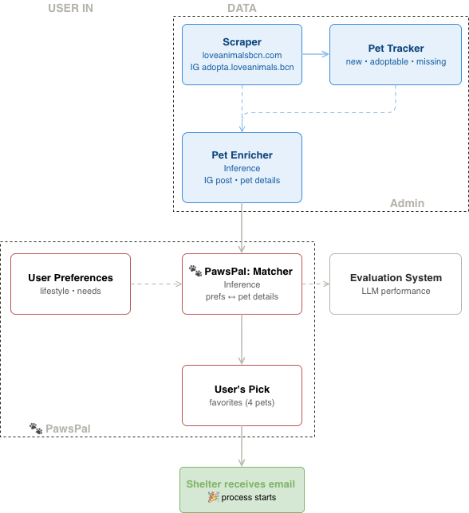

[← Back](../)

# Pawspal

> *🐾 Find your perfect pawtner!*

## What it does

**Pawspal** matches families with the right pets. It scrapes [loveanimalsbcn](https://loveanimalsbcn.com/), ranks your best-fit pets by lifestyle, and contacts the [CAACB](https://ajuntament.barcelona.cat/benestaranimal/es/cercador-danimals-en-adopcio) shelter directly — turning every match into a *happy, lasting home*.

## Two apps, one mission

**PawsPal** ships as **two Streamlit apps** — one for adopters, one for the shelter.

🚧 *Under Construction!*

### 🐾 PawsPal

Where families find their match.

- Set your lifestyle and preferences (home, time, experience).
- Get matched pets ranked by compatibility, each with photos and a summary.
- Contact the shelter in one click to start the adoption.

> *▶️ Watch [PawsPal](https://drive.google.com/file/d/1y7InBB8bS6Mlz-MmBUpUY8AIarq0m_qM/view?usp=drive_link) in action!*

### 🐶 Shelter Dashboard

Where shelter staff keep listings fresh and prioritize urgent cases.

- Review and edit every pet card (name, photo, summary) inline.
- Flag urgent and featured pets, track status (🟢 active / 🔴 archived).
- Control panel with live counts by type and status.

> *▶️ Watch the [Admin dashboard](https://drive.google.com/file/d/1xcHLxRyT7BqUP34fQF3qthfCZkhiRnK0/view?usp=sharing) in action!*

## Run it locally

🔜 *Coming Soon!*

## Stack

