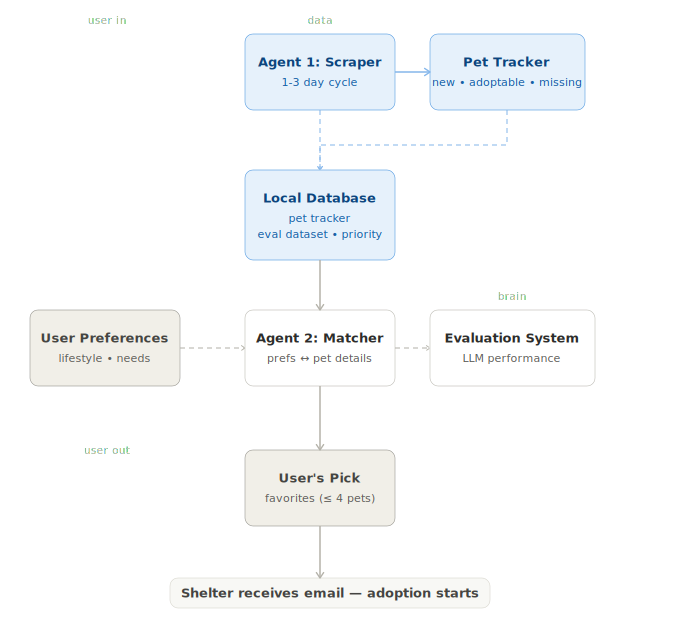

[← Back](../)

# Pawspal

> *🐾 Find your perfect pawtner!*

## What it does

**Pawspal** uses intelligent matching to bridge the gap between families and pets, automating the adoption process so every match leads to a *happy, lasting home*!

**Pawspal** scrapes [loveanimalsbcn](https://loveanimalsbcn.com/), matches you with 4 pets based on your lifestyle, and directly contacts [CAACB](https://ajuntament.barcelona.cat/benestaranimal/es/cercador-danimals-en-adopcio) shelter to start your adoption journey! 



🚧 *Under Construction!*

## Multi-Agent Architecture

Built with **CrewAI** — 2 specialized agents work together:

| Agent | Role |
|-------|------|
| 🕷️ Scraper | Fetches latest pets from [loveanimalsbcn](https://loveanimalsbcn.com/) |
| 🧠 Matcher | Analyzes your profile and ranks compatibility |


## Run it locally
```bash
# Install dependencies
pip install -e .

# Launch the app
uv run streamlit run app/pawspal.py
```

Available at → `http://localhost:8501`

## Stack

  