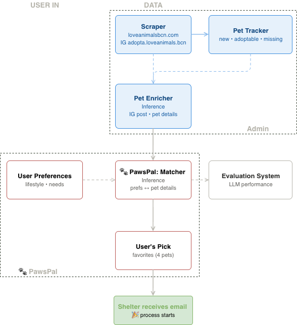

[← Back](../)

# Pawspal

> *🐾 Find your perfect pawtner!*

## What it does

**Pawspal** matches families with the right pets. It scrapes [loveanimalsbcn](https://loveanimalsbcn.com/), ranks your best-fit pets by lifestyle, and contacts the [CAACB](https://ajuntament.barcelona.cat/benestaranimal/es/cercador-danimals-en-adopcio) shelter directly — turning every match into a *happy, lasting home*.

## One app, one dashboard

**PawsPal** ships as a matching app for adopters and a dashboard for shelter staff.

### 🐾 PawsPal

Where *families* find their match.

> *▶️ Watch [PawsPal](https://drive.google.com/file/d/1y7InBB8bS6Mlz-MmBUpUY8AIarq0m_qM/view?usp=sharing) in action!*

- Onboarding captures household context — home type, kids, other pets, experience, PPP-dog opt-in.
- Swipe deck of matched pets, each with photo, bio, and match rationale.
- Favourites list, with restricted-breed (PPP) requirements shown inline.
- Send favourites to the shelter team to start the adoption.

### 🐶 Staff Dashboard

Where *shelter staff* keep listings fresh and prioritize urgent cases.

> *▶️ Watch the [Admin dashboard](https://drive.google.com/file/d/1xcHLxRyT7BqUP34fQF3qthfCZkhiRnK0/view?usp=sharing) in action!*

- Full pet-record editor — photos, video, AI-regenerated bio text.
- Health tab: vaccines, sterilization, microchip, meds/treatments log.
- Context flags: urban fit, good with kids/dogs/cats, experience needed, PPP status.
- Status and urgency toggles, publish straight to Instagram.
- Filter and search across species, size, priority, and center.

## Stack

