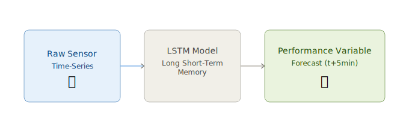

[← Back](../)

# ⚙️ SAG-Mill

> Predicting industrial performance 5 minutes into the future using deep learning on sequential sensor data.

👩🏻‍💻 *This project was developed as part of an interview process with [intellisense.io](https://www.intellisense.io/)*. 

## The Problem

**Semi-Autogenous (SAG) mills** crush large rocks in mining operations — and their performance is critical. Unexpected failures or inefficiencies cost millions.

**Goal:** Predict key performance variables **5 minutes in advance** using historical sensor readings.

## Approach

**Why LSTM?**  
Unlike traditional models, LSTM captures long-range temporal dependencies without requiring fixed input windows — ideal for complex industrial sequences.

## Results

| Metric | Result |
|--------|--------|
| Pressure prediction | ✅ Aligned with baseline |
| Power prediction | ❌ Not extracted |
| Overfitting | ⚠️ Present (*not addressed in this iteration*) |

> Pressure forecasting with 20-minute history confirms baseline trends. Further work needed to resolve overfitting and extract power data.

## Stack



🔗 View full code on [GitHub](https://github.com/cucu-o0/SAG-Mill)